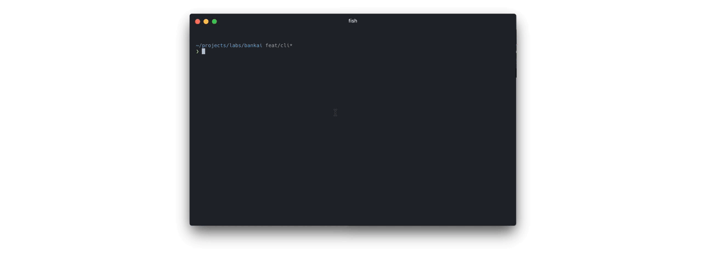

# Basic bankai example

This basic usage example is intended as help during the getting started phase
of developers looking into bankai as development tool.



## Features

*  Easy cli usage
*  Isomorphic rendering
*  Scoped styles via sheetify
*  Hot Module Replacement

## Installation

```shell
npm install
```

## Usage

```shell
npm start
```
